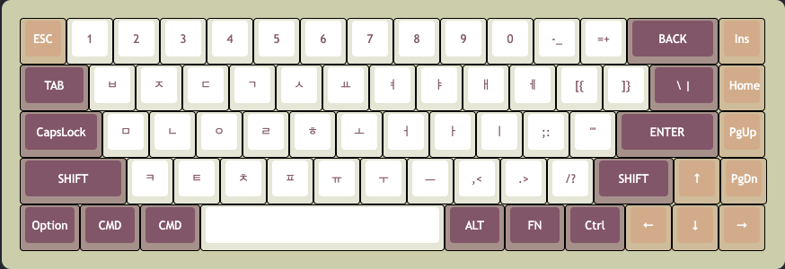
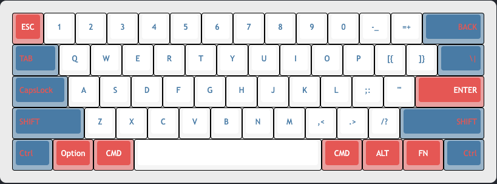

# glassic.js 

Vanilla JS library to create an customize your ideal machanical keyboards

The library currently supports 60% and 65% keyboard.
Users can customize, export and import layouts as well as sharing their favorite custom keyboard

